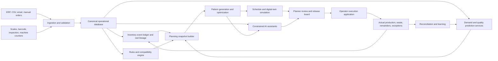

# Paper Cutting Decision Intelligence System

**Implementation blueprint**  
**Status:** Build-ready greenfield specification  
**Prepared:** 2026-08-28  
**Working name:** PaperBrain

## 1. Purpose

Build a closed-loop system that can progressively replace routine paper-cutting planning decisions while keeping physical feasibility, inventory accuracy, and business policy explicit and auditable.

The system must decide, for each planning horizon:

- which physical reel to use;
- whether to consume an open/in-consumption reel or open a fresh reel;
- which sheet orientation and cutting pattern to run;
- how many cross-cuts or metres to run;
- which orders may share a run;
- whether an order may be split, delayed, overproduced, or produced early;
- whether a remainder is valuable inventory, work in process, downgrade, or scrap;
- how jobs should be sequenced on real machines;
- how the plan should change after an urgent order, defect, inventory mismatch, or machine event;
- why the selected plan is preferable to the next-best feasible alternative.

This is not merely a trim-loss calculator. It is a paper-conversion decision system combining:

1. a canonical inventory and production ledger;
2. a deterministic rules and feasibility engine;
3. mathematical optimization for patterns, reel allocation, and scheduling;
4. probabilistic demand and quality models where inputs are uncertain;
5. a digital-twin simulator for policy and plan validation;
6. constrained AI assistants for intake, explanation, and exception handling;
7. execution capture and reconciliation so every decision improves the next one.

## 2. Canonical problem statement

The company owns a changing inventory of paper reels. Every reel has a finite remaining length even when it is operationally treated as “very long.” Reels differ by material, GSM, nominal width, effective usable width, remaining mass or length, edge condition, location, age, status, and machine compatibility.

Customers submit order lines requesting a quantity of sheets with dimensions `y × z`, material and quality requirements, due dates, grain/orientation rules, and quantity tolerances. Some order families recur periodically. Some reels are already open or partially consumed. Some have damaged edges or defects whose geometry changes the usable width over part of the reel.

The system must select physically executable cutting and scheduling decisions that meet committed service obligations while minimizing total economic loss over time. Economic loss includes material trim, damaged paper, tail loss, unusable overrun, setup waste, fresh-reel openings, changeovers, handling, inventory aging, tardiness, and loss of strategically useful remnants. Retained reusable material is inventory, not immediate waste, but must receive a conservative future-use value rather than an unlimited salvage credit.

The system must distinguish:

- **hard constraints:** safety, material, quality, machine limits, geometry, inventory availability, grain direction, and released-order commitments;
- **soft preferences:** use open reels, reduce trim, preserve useful remnants, reduce setups, stabilize the schedule, and selectively anticipate recurring demand;
- **facts:** measured width, mass, inspection, machine counter readings;
- **estimates:** remaining length, defect progression, demand probability, setup duration;
- **decisions:** reservations, plans, schedule release, remnant retention, and approved substitutions.

## 3. Non-negotiable design decisions

### 3.1 Finite length is always modeled

Remaining reel length is estimated from measured net paper mass when direct metre data is unavailable:

\[
L_{m} = \frac{1{,}000{,}000 M_{kg}}{W_{mm}G_{g/m^2}}
\]

This estimate is valid only when mass excludes the core and wrapping and when width and GSM are trustworthy. A second estimate may be calculated from reel and core diameters plus caliper:

\[
L \approx \frac{\pi(D^2-d^2)}{4t}
\]

The two estimates are stored separately with confidence and provenance. Material disagreement beyond a configured tolerance creates an inspection exception; it is not silently averaged away.

### 3.2 Machine capability determines the mathematical model

The MVP assumes a conventional sheeter in which all lanes across the web share one machine-direction cross-cut length during a run. Orders with different cross-cut lengths cannot share that pattern unless a verified machine capability permits it.

Each machine has explicit capability flags:

- `shared_crosscut_length`;
- `lanes_can_stop_independently`;
- `supports_mixed_crosscut_lengths`;
- `supports_roll_to_roll_slitting`;
- `supports_roll_to_sheet`;
- `supports_two_stage_route`.

No capability is inferred from planner habit or from a favorable waste result. If independent lanes or a two-stage slitting/sheeter route is confirmed, a specialized formulation is enabled behind the same planning interface.

### 3.3 One physical object has one identity

Every master reel, open reel, child reel, retained remainder, finished pallet, and waste transaction has a unique ID and traceable lineage. A parent reel and material already split into children cannot both be available inventory.

### 3.4 Canonical units are mandatory

Store:

- width and length in millimetres;
- distance run in metres where operationally useful, with exact conversion;
- mass in kilograms;
- GSM in grams per square metre;
- time in UTC timestamps and integer seconds;
- money in integer minor currency units plus currency code.

Every imported value retains its original text, source unit, parser result, and confidence. Ambiguous values are provisional or quarantined, never guessed into executable inventory.

### 3.5 Service and feasibility outrank local trim

Use lexicographic optimization. A small material saving may not cause a late committed order, forbidden substitution, unsafe pattern, or unapproved overproduction.

### 3.6 Open-reel preference is bounded

Prefer already-open reels using a fresh-opening penalty, age/condition credit, handling cost, and future-value protection. Do not implement “always use open stock first” as an unconditional rule.

### 3.7 AI cannot certify feasibility

Only the deterministic rules engine and optimization validator can declare a plan executable. AI assistants may extract, explain, compare, and request a solve. They may not invent dimensions, modify physical inventory, release orders, or send machine instructions without the configured approval path.

## 4. Goals, non-goals, and success definition

### 4.1 Product goals

- Create a trustworthy roll-level source of truth with immutable inventory events.
- Produce feasible, explainable plans for a pilot material family and machine.
- Minimize total economic material loss while protecting due dates and quality.
- Correctly represent open reels, fresh reels, damaged edges, finite length, and remnants.
- Exploit known recurrence and probabilistic future demand without treating forecasts as firm orders.
- Support fast emergency repair and slower full-horizon optimization.
- Compare policy scenarios and the next-best feasible alternative.
- Capture actual execution, reconcile material balance, and improve model parameters.
- Progress from recommendation to conditional autonomy through measurable release gates.

### 4.2 Initial non-goals

- Direct PLC or blade actuation.
- Fully autonomous inventory corrections or material substitutions.
- Deep-learning replacement of the optimization solver.
- Computer-vision defect mapping before basic inspection data is reliable.
- Simultaneous optimization of every plant, grade, machine, and procurement decision in the MVP.
- Claims of optimality when a time-limited solver returns only a feasible incumbent.
- Claims of percentage savings before historical replay and shadow-mode measurement.

### 4.3 Final outcome

For a new order or planning run, the system can state:

1. whether the order is feasible with verified inventory;
2. the exact reel, machine, orientation, pattern, run length, and sequence;
3. expected good sheets, overrun, material consumed, trim, defect loss, setup loss, and resulting remainder;
4. whether the plan uses open or fresh stock and why;
5. how committed and forecast demand influenced the choice;
6. the next-best feasible alternative and its cost breakdown;
7. the assumptions and confirmations still required;
8. how to recover if measured reel or machine state differs at execution;
9. after execution, where every kilogram went.

## 5. Decision horizons and autonomy

| Horizon | Typical range | Decisions | Method |
|---|---:|---|---|
| Strategic | 3–24 months | master-width assortment, suppliers, equipment capability | scenario simulation and portfolio optimization |
| Tactical | 2–12 weeks | reservations, procurement signals, remnant value, controlled pre-production | stochastic rolling-horizon optimization |
| Operational | current shift–14 days | reel assignment, patterns, quantities, machines, sequence | pattern generation, CP-SAT/MIP, scheduling |
| Execution | minutes–hours | scan validation, run actuals, exception repair | rules, local re-optimization, approval workflow |

Autonomy levels:

0. **Observe:** data validation and reports only.
1. **Recommend:** all plans require planner approval.
2. **Routine auto-plan:** low-risk classes may be planned automatically; release still requires approval.
3. **Conditional release:** policy-approved routine plans release automatically; exceptions escalate.
4. **Closed-loop autonomy:** automatic rolling plans and execution integration within certified boundaries.

The project starts at level 0 and must earn each transition with explicit acceptance evidence.

## 6. Architecture



### 6.1 Deployable components

1. **API application** — typed REST endpoints, authentication, approvals, queries.
2. **Worker application** — imports, pattern generation, solves, simulations, forecasts, reports.
3. **Planner web application** — data review, scenario comparison, planning and release.
4. **Execution web application** — scan-first shop-floor interface.
5. **PostgreSQL** — operational records, immutable events, snapshots, solver runs, audit.
6. **Object storage** — source documents, photos, solver artifacts, report exports.
7. **Job queue** — durable background jobs with idempotency and cancellation.
8. **Optimization package** — solver-independent domain model, generators, validators, adapters.
9. **Forecast package** — recurrence rules, baselines, probabilistic models, backtests.
10. **Simulation package** — execution replay, uncertainty scenarios, policy evaluation.
11. **AI tool gateway** — read-only by default, schema-validated mutations, approvals.

### 6.2 Recommended implementation stack

- Python 3.12 for backend, optimization, forecasting, and simulation.
- FastAPI and Pydantic v2 for typed HTTP contracts.
- SQLAlchemy 2 and Alembic for persistence and migrations.
- PostgreSQL 16 or a later organization-supported version.
- OR-Tools CP-SAT for integer allocation and scheduling logic.
- HiGHS or SCIP for LP relaxation and dual prices used by column generation.
- NumPy, SciPy, pandas, and scikit-learn for numeric and predictive work.
- React with TypeScript for planner and execution interfaces.
- A durable queue such as Celery/Redis or the organization’s standard workflow runner.
- OpenTelemetry-compatible traces, structured logs, and metrics.
- Docker containers for consistent local, test, and deployment environments.

Exact dependency versions must be locked in repository files after an initial compatibility spike. Domain interfaces must not expose vendor-specific solver objects.

## 7. Repository layout

Create the following greenfield layout:

```text
paperbrain/
├── README.md
├── pyproject.toml
├── uv.lock
├── docker-compose.yml
├── Makefile
├── .env.example
├── docs/
│   ├── architecture.md
│   ├── domain-glossary.md
│   ├── machine-survey.md
│   ├── optimization-model.md
│   ├── policies.md
│   ├── data-import-contract.md
│   ├── runbooks/
│   └── adr/
├── apps/
│   ├── api/
│   │   ├── main.py
│   │   ├── dependencies.py
│   │   └── routes/
│   ├── worker/
│   │   ├── main.py
│   │   └── jobs/
│   ├── planner-web/
│   └── execution-web/
├── src/paperbrain/
│   ├── config/
│   ├── domain/
│   │   ├── units.py
│   │   ├── materials.py
│   │   ├── reels.py
│   │   ├── orders.py
│   │   ├── machines.py
│   │   ├── patterns.py
│   │   ├── plans.py
│   │   ├── policies.py
│   │   └── events.py
│   ├── application/
│   │   ├── commands/
│   │   ├── queries/
│   │   ├── services/
│   │   └── approvals/
│   ├── persistence/
│   │   ├── models/
│   │   ├── repositories/
│   │   ├── migrations/
│   │   └── outbox.py
│   ├── ingestion/
│   │   ├── raw_store.py
│   │   ├── parsers/
│   │   ├── validators/
│   │   └── reconciliation.py
│   ├── rules/
│   │   ├── compatibility.py
│   │   ├── geometry.py
│   │   ├── inventory.py
│   │   └── feasibility.py
│   ├── optimization/
│   │   ├── snapshot.py
│   │   ├── preprocessing.py
│   │   ├── orientations.py
│   │   ├── pattern_generator.py
│   │   ├── dominance.py
│   │   ├── heuristic.py
│   │   ├── master_model.py
│   │   ├── column_generation.py
│   │   ├── scheduler.py
│   │   ├── objectives.py
│   │   ├── validator.py
│   │   ├── alternatives.py
│   │   └── solvers/
│   │       ├── base.py
│   │       ├── cpsat.py
│   │       └── highs.py
│   ├── forecasting/
│   │   ├── features.py
│   │   ├── recurrence.py
│   │   ├── intermittent.py
│   │   ├── scenarios.py
│   │   ├── backtest.py
│   │   └── registry.py
│   ├── simulation/
│   │   ├── engine.py
│   │   ├── events.py
│   │   ├── uncertainty.py
│   │   └── replay.py
│   ├── execution/
│   │   ├── tickets.py
│   │   ├── reconciliation.py
│   │   └── exceptions.py
│   ├── agents/
│   │   ├── tool_gateway.py
│   │   ├── order_intake.py
│   │   ├── planner_copilot.py
│   │   ├── exception_agent.py
│   │   └── data_steward.py
│   ├── reporting/
│   └── observability/
├── tests/
│   ├── unit/
│   ├── property/
│   ├── integration/
│   ├── optimization/
│   ├── replay/
│   ├── security/
│   └── fixtures/
├── scripts/
│   ├── import_inventory.py
│   ├── import_orders.py
│   ├── run_shadow_plan.py
│   └── reconcile_shift.py
└── infra/
    ├── docker/
    ├── migrations/
    ├── monitoring/
    └── deployment/
```

Keep domain objects independent of ORM models and solver libraries. Use ports/adapters so a solver or queue can be replaced without rewriting business rules.

## 8. Canonical domain model

### 8.1 Data confidence and lifecycle

All important records have a verification state:

- `verified`: usable in released plans;
- `provisional`: usable only in clearly labelled what-if scenarios;
- `quarantined`: excluded from optimization;
- `retired`: historical and not active.

Every measurement has:

- value and canonical unit;
- source type and source reference;
- observed timestamp;
- observer/device;
- uncertainty or tolerance;
- verification state.

### 8.2 Material specification

`material_spec`

| Field | Type | Rule |
|---|---|---|
| `id` | UUID | immutable |
| `family` | text | controlled vocabulary, e.g. SBS |
| `grade` | text | controlled within family |
| `gsm_value` | decimal nullable | exact value if known |
| `gsm_min`, `gsm_max` | decimal nullable | range when exact value unresolved |
| `supplier_id` | UUID nullable | separate from GSM text |
| `supplier_grade` | text nullable | supplier-specific name |
| `finish`, `colour`, `coating` | text/enum | explicit compatibility attributes |
| `grain_rule` | enum | unrestricted, machine-direction, cross-direction |
| `quality_class` | enum | controlled |
| `cost_minor_per_kg` | integer | effective-dated |
| `scrap_credit_minor_per_kg` | integer | conservative recovery value |
| `shelf_life_days` | integer nullable | if applicable |
| `compatibility_group_id` | UUID | strict matching partition |
| `valid_from`, `valid_to` | timestamp | effective dating |

Substitution is represented in a separate approved `material_substitution` table with direction, effective dates, customer restrictions, and approver. Similar text labels do not imply compatibility.

### 8.3 Physical reel

`reel`

| Field | Type | Rule |
|---|---|---|
| `id` | UUID | database identity |
| `reel_code` | text unique | barcode/QR value |
| `root_reel_id` | UUID | original ancestor |
| `parent_reel_id` | UUID nullable | immediate lineage |
| `material_spec_id` | UUID | required |
| `nominal_width_mm` | integer | immutable receipt value |
| `state` | enum | see state machine below |
| `verification_state` | enum | only verified is executable |
| `location_id` | UUID | required unless consumed/scrapped |
| `reservation_id` | UUID nullable | prevents double allocation |
| `received_at`, `opened_at`, `last_used_at` | timestamp nullable | lifecycle |
| `net_mass_kg` | decimal nullable | current measured/estimated value |
| `remaining_length_mm` | bigint nullable | estimated or measured |
| `remaining_length_low_mm`, `remaining_length_high_mm` | bigint nullable | uncertainty interval |
| `length_confidence` | decimal | 0 to 1 |
| `outer_diameter_mm`, `core_diameter_mm` | decimal nullable | alternate estimate inputs |
| `handling_count` | integer | deterioration feature |
| `quality_status` | enum | released, hold, downgraded, rejected |
| `version` | integer | optimistic concurrency |

Reel states:

```text
unopened -> reserved -> staged -> running -> opened
opened -> reserved -> staged -> running -> opened
running -> exhausted
running -> split
opened/unopened -> quarantined
quarantined -> opened/unopened       only after approved release
any available state -> missing
opened/unopened/quarantined -> scrapped
```

`split` means the parent is unavailable and material exists through child records and waste events. State transitions occur through commands that append ledger events; direct state mutation is prohibited outside projections.

### 8.4 Reel measurements and defect geometry

`reel_measurement`

- `id`, `reel_id`, `measurement_type`;
- canonical numeric value and unit;
- original value and original unit;
- measurement method: scale, manual, sensor, machine counter, derived;
- uncertainty, timestamp, actor/device, source document;
- verification status.

`reel_segment`

- `id`, `reel_id`;
- `start_length_mm`, `end_length_mm` along remaining reel;
- `left_unusable_mm`, `right_unusable_mm`;
- `mandatory_left_trim_mm`, `mandatory_right_trim_mm`;
- `usable_interval_start_mm`, `usable_interval_end_mm`;
- confidence and inspection status.

`defect_zone`

- segment or exact length range;
- cross-web start/end positions;
- defect type, severity, affected quality classes;
- inspection image reference;
- disposition rule: avoid, trim, tolerant-order-only, stop-and-inspect.

MVP supports constant left/right edge loss for a reel. Phase 4 supports piecewise length segments. Full 2D local defect placement is enabled only where inspection data quality justifies it.

### 8.5 Order and order line

`customer_order`

- `id`, external ID, customer ID, contract ID;
- received timestamp, promised timestamp, priority/service class;
- status: draft, validation_required, confirmed, released, running, complete, cancelled;
- version and source document.

`order_line`

| Field | Rule |
|---|---|
| `sheet_width_mm`, `sheet_length_mm` | required positive integers |
| `quantity_required` | positive integer |
| `quantity_min`, `quantity_max` | derived from explicitly approved under/overrun |
| `pack_size` | optional divisibility constraint |
| `material_spec_id` | exact requested material |
| `allowed_substitution_set_id` | explicit only |
| `rotation_allowed` | explicit boolean, never inferred |
| `grain_requirement` | explicit enum |
| `edge_lane_restriction` | none, avoid-left, avoid-right, inner-only |
| `quality_class` | required |
| `earliest_start_at`, `due_at` | required for released work |
| `split_across_reels_allowed` | explicit |
| `split_across_days_allowed` | explicit |
| `early_production_allowed` | explicit |
| `max_early_days` | required if early production allowed |
| `machine_allowlist`, `machine_denylist` | optional |
| `recurrence_family_id` | optional |
| `commercial_priority` | authorized field, audited |

Order revisions create new versions. A released plan references an immutable order-line version.

### 8.6 Machine and process route

`machine`

- min/max web width;
- max reel mass and diameter;
- supported cores/chucks;
- min/max cross-cut length;
- minimum lane width;
- maximum lane count or knife count;
- edge trim and kerf rules;
- supported material/quality groups;
- speed curve by material/GSM/geometry;
- setup and transition-time matrix;
- maintenance calendar and shifts;
- capability flags from Section 3.2;
- measurement tolerances and sensor availability.

`process_route`

- one-stage roll-to-sheet;
- roll-to-roll slitting then roll-to-sheet;
- approved machines per stage;
- maximum waiting time and WIP constraints between stages;
- lineage requirements for child reels.

### 8.7 Pattern, run, plan, and schedule

`cutting_pattern`

- material compatibility group;
- machine capability version;
- common cross-cut length;
- ordered lane positions and assigned order orientation;
- left/right trim, inter-lane kerf, total used width;
- maximum/minimum cross-cuts;
- source algorithm and generator version;
- canonical signature for deduplication;
- feasibility certificate hash.

`plan_run`

- plan, reel/segment, machine, pattern;
- planned cross-cut count and metres;
- per-order output, overrun, pack allocation;
- planned start/end, setup family;
- expected mass breakdown;
- resulting reel/remnant state;
- confidence and risk flags.

`planning_run`

- input snapshot ID;
- policy version;
- algorithm and solver versions;
- random seed;
- start/end time and time limit;
- status: queued, running, feasible, optimal, timeout_feasible, infeasible, failed, cancelled;
- objective vector by lexicographic stage;
- best bound and gap where available;
- selected plan ID and alternative IDs;
- logs and artifacts.

### 8.8 Immutable inventory and production ledger

Events include:

- `ReelReceived`, `ReelMeasured`, `ReelInspected`, `ReelMoved`;
- `ReelReserved`, `ReservationReleased`, `ReelStaged`;
- `RunStarted`, `RunPaused`, `RunCompleted`, `RunAborted`;
- `ReelOpened`, `ReelSplit`, `ChildReelCreated`, `ReelExhausted`;
- `FinishedGoodsCreated`, `WasteRecorded`, `RemainderReturned`;
- `ReelQuarantined`, `ReelReleasedFromHold`, `ReelMissing`, `ReelScrapped`;
- `InventoryCorrectionProposed`, `InventoryCorrectionApproved`.

Current inventory is a projection of events. Use an outbox table in the same transaction to publish reliable integration events.

### 8.9 Required invariants

Block or alert on:

- duplicate active reel code;
- active split parent and active child material at the same time;
- child mass plus waste exceeding parent mass beyond tolerance;
- allocated length exceeding remaining length;
- effective width exceeding nominal width;
- invalid, missing, or ambiguous units in executable records;
- negative mass, length, dimensions, or quantity;
- incompatible material, GSM, quality, machine, or grain assignment;
- order output outside approved quantity tolerance;
- WIP presented as available stock;
- stale reservations;
- quarantined, missing, or provisional reels in released plans;
- concurrent plans reserving the same reel segment;
- unexplained mass-balance variance beyond policy tolerance.

## 9. Import, normalization, and data quality

### 9.1 Import contract

Use separate import types, never blank rows or headings to change record meaning:

- material master;
- individual reels;
- aggregate stock groups;
- remnants/child reels;
- work in process;
- orders and order lines;
- machine constraints;
- historical production actuals.

Every import follows:

1. store original file and checksum;
2. store every raw row with source coordinates;
3. parse into a typed staging schema;
4. attach field-level errors, warnings, unit confidence, and suggested corrections;
5. require human review for ambiguous physical data;
6. commit verified records through domain commands;
7. produce a reconciliation report and immutable import audit.

### 9.2 Data-quality score

Calculate scores separately for geometry, identity, material, quantity, location, and freshness. Do not collapse critical failures into a reassuring average.

Example executable rule:

```text
executable =
  identity == verified
  and geometry == verified
  and material == verified
  and availability == verified
  and quality_status == released
  and state in {unopened, opened}
```

### 9.3 Aggregate stock migration

Aggregate rows may support tactical scenarios but not exact reel assignment. Expand them only after physical identification. Until then, represent them as `stock_lot` records excluded from executable operational plans.

### 9.4 Physical audit workflow

For each pilot reel:

1. scan or assign identity;
2. verify material and supplier label;
3. measure width and edge condition;
4. weigh or capture diameter/core;
5. record location and status;
6. identify parent/child relationships;
7. attach photos where condition is uncertain;
8. mark verified, provisional, or quarantined;
9. reconcile total mass to accounting stock.

## 10. Rules and feasibility engine

The rules engine is deterministic, versioned, and usable independently of the optimizer.

### 10.1 Candidate orientation generation

For a requested sheet `A × B`, generate:

- orientation 1: lane width `A`, cross-cut length `B`;
- orientation 2: lane width `B`, cross-cut length `A`, only if rotation and grain rules permit.

An orientation includes material, quality, edge-position, machine, tolerance, and process-route requirements. It is more than a pair of dimensions.

### 10.2 Pattern geometry

For reel segment usable interval width `U`, a simple pattern must satisfy:

\[
\sum_o a_{op}w_{op} + k_p + t^{left}_p + t^{right}_p \le U
\]

where:

- `a_op` is the lane count for order orientation `o` in pattern `p`;
- `w_op` is lane width;
- `k_p` is total inter-lane kerf or blade allowance;
- left/right trim includes machine minimums and measured damaged-edge exclusion.

All lanes in the MVP pattern share one cross-cut length. Lane positions are explicit so asymmetric damage and edge-sensitive orders can be validated.

### 10.3 Feasibility API

The engine exposes pure operations:

- `get_allowed_orientations(order_line, machine)`;
- `is_material_compatible(order_line, reel)`;
- `is_reel_machine_compatible(reel, machine)`;
- `validate_pattern(pattern, reel_segment, machine)`;
- `validate_run(run, snapshot)`;
- `validate_plan(plan, snapshot, policy)`;
- `explain_violation(violation_code, context)`.

Every released plan is recalculated by this engine from primitive inputs. Never trust cached solver coefficients as the final validation.

## 11. Optimization design

### 11.1 Solver portfolio

Use different methods for different latency and scale requirements:

- **Fast heuristic:** sub-second to several seconds for quote checks, warm starts, and emergency repair.
- **Enumerated-pattern CP-SAT/MIP:** daily MVP planning for moderate instances.
- **Column generation plus integer master:** large width-pattern spaces.
- **Scheduling CP-SAT or local search:** machine sequence and transitions.
- **Simulation:** uncertainty and policy evaluation, not feasibility authority.

The public planning contract is solver-independent.

### 11.2 Preprocessing pipeline

For each snapshot:

1. freeze immutable versions of orders, reels, machine capabilities, policies, and measurements;
2. exclude non-executable inventory;
3. partition by material/quality compatibility;
4. generate valid order orientations;
5. group by common cross-cut length and compatible process route;
6. generate reel segments from defect/usable-width profiles;
7. identify compatible machines and time windows;
8. calculate strict lower bounds for material area, length, service, and capacity;
9. eliminate dominated reels and patterns only with recorded proof;
10. construct coefficients in integer units and validate overflow limits;
11. generate a heuristic incumbent before the exact solve.

### 11.3 Candidate pattern generation for MVP

For each material group, machine, cross-cut length, and usable-width class:

1. collect allowed lane orientations;
2. enforce lane-count/knife limits;
3. enumerate or dynamically program feasible multisets;
4. place lanes explicitly when edge restrictions matter;
5. calculate trim, kerf, output per cross-cut, setup family, and signature;
6. discard exact duplicates;
7. remove dominated patterns conservatively;
8. include historically useful and single-order fallback patterns;
9. cap candidate count using configurable quality thresholds, not arbitrary first-N order.

A pattern `p1` may dominate `p2` for the same machine and width class only if it is no worse in all protected dimensions: production vector, consumed width, setup family, edge feasibility, quality eligibility, and future remnant class. Dominance removal must never discard the only pattern satisfying a specific order.

### 11.4 Fast heuristic

Implement a deterministic heuristic with seeded tie-breaking:

1. sort released orders by lateness risk, material scarcity, width, and quantity;
2. tier candidate reels: compatible open at-risk, compatible open, fresh, provisional scenario only;
3. use best-fit decreasing to seed lane groups by common cross-cut length;
4. allocate finite cross-cut counts to quantity and reel length;
5. repair overrun, pack-size, and split constraints;
6. perform local moves: lane swap, pattern merge, reel swap, order split/unsplit;
7. sequence runs by setup-transition cost;
8. validate the complete result independently.

Return a plan even when the exact solver times out, provided independent validation passes. Label its provenance and do not claim optimality.

### 11.5 Integer master formulation

Sets:

- `R`: verified reel segments;
- `P_r`: patterns feasible for reel segment `r`;
- `O`: order lines or authorized forecast demand items;
- `M`: machines;
- `T`: planning periods where time indexing is required.

Key parameters:

- `a_op`: sheets of order `o` produced by one cross-cut of pattern `p`;
- `h_p`: machine-direction cross-cut length in millimetres;
- `s_rp`: setup/head/tail length loss for activating pattern `p` on reel `r`;
- `L_r`: conservative available length of reel segment `r`;
- `W_r`: nominal physical width used for material-cost accounting;
- `U_r`: usable interval width used for geometry;
- `c_r`: material cost per area or mass;
- `d_o_min`, `d_o_max`: allowed production bounds;
- `fresh_r`: whether using reel `r` opens fresh stock;
- setup, handling, lateness, remnant-value, and stability coefficients.

Primary variables:

- `n_rp >= 0`, integer: number of cross-cuts of pattern `p` on reel `r`;
- `y_rp`, boolean: pattern activation;
- `g_r`, boolean: reel selected/opened;
- `produced_o`, integer;
- `short_o`, integer or fixed zero for released demand;
- `over_o`, integer;
- optional `assign_rpt` and sequence variables when allocation and schedule are combined.

Production:

\[
produced_o = stock_o + \sum_{r}\sum_{p\in P_r} a_{op}n_{rp}
\]

Demand bounds:

\[
d^{min}_o - short_o \le produced_o \le d^{max}_o
\]

For released orders, `short_o = 0` unless the run is explicitly an infeasibility analysis. Forecast items have scenario-dependent optional fulfillment and may never hide a committed shortage.

Finite reel length:

\[
\sum_{p\in P_r} h_p n_{rp} + \sum_{p\in P_r}s_{rp}y_{rp} \le L_r
\]

Activation:

\[
n_{rp} \le M_{rp}y_{rp}
\]

Fresh opening:

\[
g_r \ge y_{rp} \quad \forall p\in P_r
\]

Additional constraints cover:

- one physical segment allocated once;
- reservations and frozen runs;
- pack-size divisibility;
- order split permissions;
- machine and period capacity;
- setup family transitions;
- earliest start and due date;
- child-reel balance for two-stage routes;
- maximum early-production and finished-goods limits;
- forecast scenario non-anticipativity in advanced planning;
- schedule stability inside firm/flexible zones.

### 11.6 Material-loss accounting

Calculate consumption and loss from geometry, not a vague pattern score.

For each activated run:

- full physical web area consumed;
- good-sheet area by order;
- damaged-edge area;
- normal width trim;
- inter-lane/knife loss;
- head/tail/setup area;
- defect excision;
- start-up test sheets;
- overproduction expected to sell;
- overproduction with no expected use;
- remaining uncut reel length;
- child reel or retained remainder value.

Convert area to mass using GSM and then to money using effective material cost and scrap credit. Remaining uncut source-reel length is inventory, not waste. A child reel is inventory only after a feasible physical split and ledger transaction.

### 11.7 Lexicographic objective

Solve sequential stages. After each stage, constrain that stage to its optimum or approved tolerance before optimizing the next.

#### Stage 1 — feasibility, safety, and committed service

- zero geometry, material, quality, inventory, and machine violations;
- zero shortage for frozen/released demand;
- minimize weighted lateness where due dates cannot all be met in an analysis run;
- preserve already-running and frozen operations.

#### Stage 2 — total material economics

Minimize:

- purchased material consumed;
- normal trim, damaged trim, defects, setup waste, and unusable tail;
- quality downgrade and disposal loss;
- unsellable overrun;
- strategic replacement cost from consuming scarce/high-value stock.

Credit conservatively:

- recycling proceeds;
- authorized sellable overrun;
- retained remnants with bounded expected future value.

#### Stage 3 — operational effort and open-stock policy

Minimize:

- fresh-reel openings;
- reel changes;
- knife/pattern changes;
- setup duration;
- handling moves and location travel;
- partial stacks and unnecessary order splits;
- overtime and avoidable idle time.

Apply bounded credits for consuming aged or deterioration-risk open reels.

#### Stage 4 — future flexibility and schedule stability

Minimize:

- consumption of reels/remnants with high expected future marginal value;
- changes to previously published work;
- fragile plans dependent on low-confidence length estimates;
- concentration of service risk in one uncertain reel or machine;
- speculative finished-goods inventory.

### 11.8 Named policy profiles

Policy profiles contain approved coefficients, tolerances, horizons, and hard/soft settings:

- `normal` — balanced service, material, open stock, and setup cost;
- `open_stock_cleanup` — stronger bounded preference for aged/open reels;
- `yield_campaign` — longer horizon and stronger material-loss priority;
- `service_recovery` — higher lateness penalties and expedited capacity;
- `cash_preservation` — stronger penalty for fresh stock and procurement exposure.

Each solve stores the exact policy version. The UI shows how a policy changes the result. Arbitrary hidden weight edits are prohibited in production.

### 11.9 Column generation for scale

When candidate patterns become too numerous:

1. start with single-order, historical, and heuristic patterns;
2. solve a restricted master LP with an LP solver that exposes dual prices;
3. solve a bounded-knapsack pricing subproblem per material, machine, cut-length, and width class;
4. include blade count, kerf, edge restrictions, and protected setup/future-value terms;
5. add negative-reduced-cost patterns;
6. repeat until no improving pattern exists or the time limit is reached;
7. solve an integer master over the generated pool;
8. repair and improve with CP-SAT/local search;
9. validate independently.

CP-SAT is not used to obtain LP dual prices. Keep the LP pricing loop and integer master as separate adapters. Branch-and-price is an optional later optimization, not required for the first production system.

### 11.10 Two-stage slitting and sheeting

If process discovery confirms parent reels are slit into child reels and later sheeted:

- Stage 1 patterns create child reels with width and length.
- Stage 2 patterns consume child reels into sheets.
- Parent, child, waste, and finished goods retain root lineage.
- The joint objective includes loss and setup at both stages.
- Child reels created for forecast demand require an approved inventory cap and conservative value.
- Sequential optimization is allowed only as a fast heuristic; final tactical comparison evaluates end-to-end cost.

### 11.11 Sequencing

Allocation and sequencing are related but separable for larger instances:

1. optimize reel/pattern/order allocation;
2. generate required runs;
3. schedule runs by machine, calendar, due date, material transition, knife movement, and setup family;
4. feed excessive setup or lateness costs back to allocation and iterate;
5. freeze near-term work and penalize changes elsewhere.

For small horizons, solve allocation and sequence jointly with CP-SAT interval variables and transition costs.

### 11.12 Alternatives and explanations

Every planning run should attempt to produce:

- selected plan;
- minimum-material alternative;
- open-stock-biased alternative;
- low-setup alternative;
- low-risk alternative;
- next-best plan subject to excluding the selected primary reel or pattern.

Report deltas in kilograms, money, time, service, openings, setups, and risk. An explanation must reference actual constraints and objective components, not generic language.

Example:

> Fresh reel R-104 is selected instead of open reel R-088 because R-088 would add 184 kg of trim and consume a width class required by a verified order due next week. The selected plan opens one fresh reel but lowers total expected cost by 31,400 minor currency units and preserves on-time delivery.

## 12. Rolling-horizon and recurring demand

### 12.1 Planning zones

- **Frozen:** current shift or configured hours; change only through exception approval.
- **Firm:** next 1–3 days; confirmed orders and selected reels.
- **Flexible:** next 1–2 weeks; confirmed orders plus probabilistic scenarios.
- **Forecast:** several weeks/months; inventory valuation and procurement, not exact operator instructions.

Replan when:

- a confirmed or rush order changes;
- a selected reel fails scan, weight, width, or quality validation;
- actual consumption exceeds tolerance;
- a machine fails or capacity changes;
- a quality hold occurs;
- the scheduled checkpoint arrives.

Apply cooldowns and significance thresholds so trivial changes do not churn the schedule.

### 12.2 Demand classification

Classify each order family as:

- contractually recurring;
- calendar recurring;
- stable frequent;
- intermittent;
- lumpy;
- new or structurally changing;
- declining/end-of-life.

Known standing orders are encoded as business rules. A model must not be asked to rediscover a contract.

### 12.3 Forecasting hierarchy

Forecast at multiple compatible levels:

- customer × SKU;
- material × GSM × exact sheet dimensions;
- material × GSM × lane width/cross-cut family;
- material family × machine;
- total kilograms and machine hours.

Exact-SKU forecasts support controlled finished-goods production. Compatible-family forecasts support remnant valuation even when the precise future customer order is unknown.

### 12.4 Model progression

Start with transparent baselines:

1. contractual recurrence rules;
2. seasonal naive and moving seasonal profiles;
3. Croston-family methods for intermittent demand;
4. separate occurrence and positive-size models;
5. gradient-boosted quantile models using calendar, customer, quote, price, lead-time, and trend features;
6. more complex sequence models only after rolling-origin evidence shows downstream benefit.

Return quantiles or scenarios, not only point forecasts.

### 12.5 Scenario generation

- Committed demand appears in every scenario.
- Contractual future demand uses declared confidence and dates.
- Likely recurring demand appears in a calibrated proportion of scenarios.
- Intermittent demand samples occurrence and size separately.
- Opportunity demand uses authorized quotation probabilities.

Forecast demand cannot mask a shortage of confirmed demand. Any pre-production requires:

- approved order family;
- minimum calibrated confidence;
- maximum early-production days;
- finished-goods storage cap;
- shelf/quality life check;
- expected saving exceeding holding and obsolescence cost;
- no negative impact on committed service.

### 12.6 Remnant future value

Long-term target calculation:

\[
V(remnant) = E[C_{future}\mid without] - E[C_{future}\mid with]
             - storage - handling - deterioration - obsolescence
\]

MVP approximation:

- width-demand match score from historical and forecast families;
- material scarcity score;
- estimated time to reuse;
- age and condition penalty;
- minimum viable length and handling threshold;
- capped salvage fraction of replacement cost.

Never let modelled remnant value exceed a configurable fraction of replacement value without approval. Track predicted versus realized remnant value.

### 12.7 Forecast evaluation

Use:

- WAPE/MASE for descriptive accuracy;
- pinball loss and interval coverage for probabilistic quality;
- calibration by demand class;
- false speculative production and stock-aging cost;
- decision regret: replay forecast-driven decisions against later actual orders.

Promotion requires downstream economic and service improvement, not a lower average prediction error alone.

## 13. Edge damage, spoilage, and uncertainty

### 13.1 Maturity levels

1. **Constant edge loss:** fixed left/right unusable width for remaining reel.
2. **Piecewise profile:** different edge loss over known length intervals.
3. **Two-dimensional map:** local tears, holes, splices, and coating defects.

Implement level 1 in the MVP, level 2 after scan/inspection workflow is stable, and level 3 only when sensors and labels are sufficiently reliable.

### 13.2 Robust planning

For uncertain effective width or length:

- executable plans use a configured conservative quantile or safety margin;
- what-if plans may use central estimates but display failure probability;
- critical orders may require physical re-measurement before reservation;
- low-confidence tail segments may be excluded from the firm zone;
- risk cost penalizes plans with no feasible backup.

### 13.3 Predictive quality models

Candidate features:

- material, supplier, GSM, age;
- storage humidity/temperature if available;
- handling count and movements;
- inspection photos and manual reason codes;
- reel diameter and open duration;
- machine force, speed, vibration, stops;
- actual trim and reject outcomes.

Initial model should be a calibrated regression or gradient-boosted model for expected left/right loss and failure probability. Computer vision is a later enhancement. Predictions never overwrite measured damage; they add risk and inspection recommendations.

## 14. Digital-twin simulation

### 14.1 Purpose

The simulator tests plans and policies under uncertainty. It does not make invalid geometry valid.

Model:

- reel consumption and uncertain remaining length;
- setup/head/tail loss;
- machine speed and setup distributions;
- machine downtime;
- edge-spoilage and defect events;
- order arrival and forecast error;
- WIP, storage, and remnant reuse;
- execution variance and operator intervention.

### 14.2 Simulation modes

- **Plan validation:** deterministic event trace for one proposed schedule.
- **Stress test:** Monte Carlo variations in length, damage, demand, and downtime.
- **Historical replay:** reconstruct information available at the historical decision time.
- **Policy comparison:** compare named objective policies over repeated scenarios.
- **Procurement/assortment:** evaluate alternative master-width inventories.

### 14.3 Required outputs

- service probability and lateness distribution;
- expected and percentile waste/cost;
- machine utilization and setup time;
- fresh openings and open-reel closure;
- remnant creation, age, and reuse;
- plan failure causes;
- value-at-risk and recommended inspection/backup actions.

## 15. Constrained AI assistants

### 15.1 Order-intake assistant

Responsibilities:

- extract dimensions, units, GSM, quantity, due date, customer, and notes from documents;
- match customers, materials, and products;
- detect ambiguity and likely unit errors;
- create a draft order with field-level provenance.

Limits:

- cannot release an order;
- cannot assume units, rotation, grain, substitution, overrun, or due date;
- must route unresolved required fields to validation.

### 15.2 Inventory data-steward assistant

Responsibilities:

- detect duplicate identities, impossible dimensions, count/mass mismatches, stale measurements, and likely parent-child conflicts;
- suggest normalized supplier/material fields;
- assemble a review queue and reconciliation narrative.

Limits:

- cannot silently modify physical inventory;
- all corrections require typed commands and configured approval.

### 15.3 Planner copilot

Responsibilities:

- translate a manager request into a named policy or a schema-validated scenario request;
- call planning, comparison, and explanation APIs;
- answer “why this reel?” and “what if?” questions from stored solver results;
- summarize trade-offs in physical and monetary units.

Limits:

- cannot create free-form solver constraints;
- cannot declare feasibility;
- cannot release a plan beyond role permission;
- numerical claims must come from APIs, not language-model arithmetic.

Example structured intent:

```json
{
  "policy_profile": "open_stock_cleanup",
  "horizon_end": "2026-09-04T18:00:00Z",
  "freeze_before": "2026-08-29T06:00:00Z",
  "scenario_filters": {
    "material_family": ["SBS"],
    "machine_ids": ["MACHINE-01"]
  },
  "requested_alternatives": ["normal", "low_setup", "low_risk"]
}
```

### 15.4 Exception assistant

- monitors significant inventory, quality, order, and machine events;
- identifies affected released runs;
- determines whether local repair is allowed;
- requests a re-solve and compares recovery options;
- alerts the correct role with severity and deadline.

Use event deduplication, cooldowns, and escalation thresholds to avoid continuous replanning noise.

### 15.5 Post-run learning assistant

- compares planned and actual quantity, material, time, and waste;
- requests missing reason codes;
- creates weekly Pareto summaries;
- proposes master-data or model changes for approval.

### 15.6 Agent security

- least-privilege tool scopes;
- schema validation for every call;
- read-only default;
- explicit approval for order release, inventory correction, material substitution, schedule release, and purchase action;
- immutable prompt, tool, result, actor, and approval audit;
- uploaded documents treated as untrusted data, not instructions;
- prompt-injection and malformed-unit tests;
- no direct machine actuation in initial phases.

## 16. APIs and contracts

### 16.1 Core REST resources

Inventory:

- `POST /v1/reels/imports`
- `GET /v1/reels`
- `GET /v1/reels/{reel_id}`
- `POST /v1/reels/{reel_id}/measurements`
- `POST /v1/reels/{reel_id}/inspections`
- `POST /v1/reels/{reel_id}/moves`
- `POST /v1/reels/{reel_id}/reserve`
- `POST /v1/reels/{reel_id}/quarantine`
- `POST /v1/reels/{reel_id}/split`

Orders:

- `POST /v1/orders/imports`
- `POST /v1/orders`
- `POST /v1/orders/{order_id}/validate`
- `POST /v1/orders/{order_id}/confirm`
- `POST /v1/orders/{order_id}/release`
- `GET /v1/orders/{order_id}/feasibility`

Planning:

- `POST /v1/planning/snapshots`
- `POST /v1/planning/runs`
- `GET /v1/planning/runs/{run_id}`
- `POST /v1/planning/runs/{run_id}/cancel`
- `GET /v1/plans/{plan_id}`
- `GET /v1/plans/{plan_id}/explanation`
- `GET /v1/plans/{plan_id}/alternatives`
- `POST /v1/plans/{plan_id}/validate`
- `POST /v1/plans/{plan_id}/approve`
- `POST /v1/plans/{plan_id}/release`

Execution:

- `POST /v1/execution/scan-check`
- `POST /v1/runs/{run_id}/start`
- `POST /v1/runs/{run_id}/pause`
- `POST /v1/runs/{run_id}/complete`
- `POST /v1/runs/{run_id}/actuals`
- `POST /v1/runs/{run_id}/exceptions`

Forecast and simulation:

- `POST /v1/forecasts/train`
- `GET /v1/forecasts/order-families/{id}`
- `POST /v1/scenarios`
- `POST /v1/simulations`
- `GET /v1/simulations/{simulation_id}`

### 16.2 Planning request

```json
{
  "snapshot_id": "uuid",
  "policy_profile": "normal",
  "horizon": {
    "start": "2026-08-28T18:00:00Z",
    "end": "2026-09-11T18:00:00Z",
    "frozen_until": "2026-08-29T06:00:00Z",
    "firm_until": "2026-08-31T18:00:00Z"
  },
  "mode": "full",
  "time_limit_seconds": 300,
  "include_forecast_scenarios": true,
  "requested_alternatives": ["open_stock_cleanup", "low_setup", "low_risk"],
  "seed": 314159
}
```

### 16.3 Planning response

```json
{
  "planning_run_id": "uuid",
  "status": "timeout_feasible",
  "selected_plan_id": "uuid",
  "objective": {
    "service_violations": 0,
    "material_loss_minor": 128400,
    "fresh_reels_opened": 1,
    "setup_seconds": 3720,
    "stability_penalty_minor": 0
  },
  "solver": {
    "name": "cpsat",
    "version": "recorded-at-runtime",
    "best_bound": 124100,
    "relative_gap": 0.0346,
    "wall_seconds": 300.0,
    "seed": 314159
  },
  "warnings": [],
  "required_confirmations": [],
  "alternative_plan_ids": ["uuid"]
}
```

### 16.4 Error contract

All APIs return stable machine-readable codes, human message, field path, source reference, and remediation where known.

Examples:

- `UNIT_AMBIGUOUS`;
- `REEL_NOT_VERIFIED`;
- `PARENT_CHILD_CONFLICT`;
- `MATERIAL_INCOMPATIBLE`;
- `NO_VALID_ORIENTATION`;
- `PATTERN_EXCEEDS_USABLE_WIDTH`;
- `REEL_LENGTH_INSUFFICIENT`;
- `ORDER_TOLERANCE_VIOLATION`;
- `STALE_SNAPSHOT`;
- `RESERVATION_CONFLICT`;
- `SOLVER_TIMEOUT_NO_FEASIBLE_PLAN`.

## 17. User interfaces

### 17.1 Inventory control

- scan/search reels;
- show identity and parent/child lineage;
- compare nominal and usable width;
- show measured and estimated mass/length with confidence;
- show defect segments and photos;
- perform weigh, inspect, move, reserve, quarantine, split, return, and scrap commands;
- highlight stale or conflicting data;
- block simultaneous availability of parent and children.

### 17.2 Order validation board

- ambiguous/incomplete orders first;
- unit, material, grain, rotation, quantity, and due-date validation;
- compatible inventory coverage;
- recurrence and customer history;
- capacity risk;
- version and source-document comparison.

### 17.3 Planning board

- due-date and feasibility risk by order;
- selected reel, segment, machine, pattern, and run length;
- lane diagram generated from exact solver variables;
- outputs, overrun, trim, defects, setup, and remnant;
- policy and objective breakdown;
- solver status, gap, data confidence, and assumptions;
- scenario alternatives and “why not?” queries;
- freeze, exclude, or pin actions followed by solver repair;
- approval and override reason capture.

### 17.4 Pattern visualization

Display:

- physical web boundaries;
- damaged and mandatory-trim zones;
- ordered lane positions;
- order/customer color, dimensions, and grain direction;
- knife positions and kerf;
- common cross-cut length;
- cross-cut count and metres;
- output per order;
- loss by category;
- resulting remainder.

The diagram is rendered from the persisted pattern/run representation, not recreated through separate layout logic.

### 17.5 Execution screen

- scan machine, reel, and run ticket;
- verify material, width, status, and reservation;
- capture pre-run weight/diameter and edge measurement;
- start, pause, resume, abort, complete;
- record metre count, good sheets, rejects, setup waste, and reason codes;
- create child/remainder labels;
- trigger exception repair when tolerance is exceeded.

### 17.6 Management analytics

- good-sheet yield and economic loss;
- waste by category, material, supplier, machine, order family, and shift;
- open stock count, age, closure, and eventual reuse;
- plan versus actual material/time/service;
- schedule adherence and changeovers;
- forecast calibration and decision regret;
- override Pareto and missing constraints;
- procurement/master-width scenario results.

## 18. End-to-end workflows

### 18.1 Order to released plan

1. Ingest order and preserve source.
2. Extract or enter typed fields.
3. Resolve required ambiguities.
4. Confirm and version order.
5. Build inventory/order/machine snapshot.
6. Generate orientations and compatible candidates.
7. Run heuristic, exact optimization, and selected alternatives.
8. Independently validate every candidate plan.
9. Run deterministic simulation and configured stress checks.
10. Present plan, alternatives, assumptions, and objective breakdown.
11. Planner approves or overrides with reason.
12. Reserve exact reels and release schedule transactionally.

### 18.2 Shop-floor execution

1. Stores scans selected reel and location.
2. Scan-check validates identity, status, reservation, material, and width.
3. Operator confirms current measurements.
4. Significant mismatch blocks start and opens exception workflow.
5. Operator executes exact pattern ticket.
6. Machine/operator records actual metres, output, time, and loss.
7. Completion creates finished goods, waste, and remainder/child events atomically.
8. Labels print only after event commit.
9. Reconciliation compares plan, machine counters, and material balance.

### 18.3 Exception repair

1. Receive event such as missing reel, narrower usable width, breakdown, rush order, or quality hold.
2. Determine affected unreleased/released/running runs.
3. Preserve completed and running decisions.
4. Apply freeze policy and identify smallest affected planning partition.
5. Run fast repair with the prior plan as warm start.
6. If no safe local repair exists, run wider re-optimization.
7. Compare service, cost, and schedule change.
8. Auto-apply only if policy allows; otherwise request approval.
9. Publish revised tickets and invalidate superseded versions.

### 18.4 Material reconciliation

For each run:

```text
input material
= good finished product
+ retained remainder/child material
+ categorized waste
+ measured process variance
```

Variance beyond tolerance requires investigation before the reel state is trusted for a future released plan.

## 19. Testing and verification

### 19.1 Unit tests

- canonical unit conversions and rounding;
- mass/length estimates and uncertainty;
- orientation generation and grain rules;
- kerf, trim, and lane geometry;
- material substitution rules;
- state transitions and permissions;
- event projection and idempotency;
- objective component calculations;
- API schema and error codes.

### 19.2 Property-based tests

Generate random but valid/invalid instances and assert:

- no lane crosses usable boundaries;
- total used width plus trim/kerf never exceeds usable width;
- total run length never exceeds reel length;
- produced counts equal lane counts times cross-cuts;
- no physical reel is double allocated;
- parent/child material balance holds;
- tightening a constraint cannot admit a formerly infeasible plan;
- validation result is independent of solver implementation;
- serialization round trips preserve exact integer geometry;
- objective recomputation equals persisted breakdown.

### 19.3 Optimization oracle tests

For small instances:

- exhaustively enumerate all patterns and assignments;
- compare heuristic and exact solver output to the enumerated optimum;
- verify lexicographic stage fixing;
- verify infeasibility certificates/reasons where possible;
- test deterministic results with fixed seed and solver settings.

Maintain golden fixtures for:

- one order/one reel exact fit;
- mixed widths with trim trade-off;
- orientation allowed/forbidden;
- open versus fresh reel trade-off;
- finite-length shortage;
- asymmetric edge damage;
- pack-size and overrun restrictions;
- recurring-demand co-production;
- two-stage parent/child balance;
- setup versus material trade-off;
- timeout with validated incumbent.

### 19.4 Integration tests

- import through validation to verified inventory;
- order release through plan reservation;
- concurrency conflict on one reel;
- plan release and execution scan;
- completion event creates outputs and updates projections;
- failed transaction creates no partial child/waste records;
- outbox events are exactly-once effective through idempotent consumers;
- role permissions and approval chains.

### 19.5 Historical replay

For each historical decision date:

1. reconstruct only information available at that time;
2. train forecasts without future leakage;
3. produce proposed plan;
4. replay later actual demand, defects, and machine events;
5. compare material, service, setup, stock age, and stability to actual decisions;
6. record confidence intervals and reasons results differ.

### 19.6 Stress and failure tests

- inches and millimetres mixed in one file;
- `100` with unknown unit;
- GSM range or supplier text in numeric field;
- duplicate active reel ID;
- parent and child both shown available;
- wrong/stale weight and negative length;
- asymmetric or changing edge damage;
- urgent orders competing for one reel;
- machine failure during firm zone;
- recurring order cancellation;
- no feasible inventory;
- solver timeout or worker crash;
- network loss during completion;
- wrong reel scanned at machine;
- repeated event delivery;
- malicious instructions in uploaded documents;
- AI tool request outside role permission.

### 19.7 Performance targets for pilot

- feasibility check: p95 under 1 second for one order against pilot inventory;
- fast heuristic repair: p95 under 5 seconds for pilot partition;
- daily exact solve: validated feasible incumbent within 30 seconds, configured full solve within 5 minutes;
- execution scan-check: p95 under 500 ms on plant network;
- inventory event commit: p95 under 1 second;
- planner page: primary plan summary usable within 2 seconds after data load.

Targets are tuned after measured pilot loads. Correctness and safety gates are never waived to meet latency.

## 20. Observability and audit

### 20.1 Structured logs

Include:

- request/correlation ID;
- actor and role;
- snapshot, policy, plan, reel, order, and machine IDs;
- solver phase and iteration;
- counts of variables, constraints, and patterns;
- incumbent, bound, gap, and elapsed time;
- validation failures and reason codes;
- approval and override events.

Never log customer documents, secrets, or unrestricted prompt content by default.

### 20.2 Metrics

- import errors by type;
- verified/provisional/quarantined inventory;
- snapshot and solve latency;
- pattern count and column-generation iterations;
- feasible/optimal/timeout/infeasible rates;
- validation rejection rate;
- schedule churn and exception frequency;
- plan-versus-actual material/time error;
- AI tool-call rejection and escalation counts.

### 20.3 Reproducibility package

Every solver run retains:

- immutable input snapshot checksum;
- policy and master-data versions;
- code/build and solver versions;
- seed and time limits;
- generated pattern signatures;
- incumbent and bound history;
- selected and alternative plans;
- independent validation report.

## 21. Security, permissions, and governance

Roles:

- viewer;
- stores operator;
- machine operator;
- quality inspector;
- planner;
- planning manager;
- inventory controller;
- material-master owner;
- system administrator;
- auditor.

Approval-controlled actions:

- inventory correction;
- quarantine release;
- material substitution;
- unapproved overrun/underrun;
- speculative production;
- modification inside frozen zone;
- plan release;
- purchase recommendation conversion to order;
- autonomy-policy changes.

Use optimistic locking on mutable projections and transactional reservations. Audit logs are append-only and exportable. Retention, backup, recovery, and customer-data controls follow company policy and applicable regulation.

## 22. Deployment and environments

Environments:

- `local`: synthetic data only;
- `test`: automated tests and ephemeral database;
- `staging`: masked historical data and plant integration sandbox;
- `shadow`: live read-only inputs, no release authority;
- `production`: approved workflows and role permissions.

Deployment rules:

- database migrations reviewed and reversible where feasible;
- feature flags for forecast demand, advanced defects, AI assistants, and autonomy;
- blue/green or rolling deployment for API/web;
- workers drain or safely cancel solves before upgrade;
- released plan artifacts remain readable after code upgrades;
- daily backups plus tested restore procedure;
- offline execution fallback provides latest released tickets and queues actuals for later synchronization.

## 23. Implementation phases

### Phase 0 — discovery and measurement study (weeks 1–4)

Deliverables:

- observed process map from receiving through finished sheets and remainders;
- confirmed meaning of every source-data field and unit;
- machine capability survey and setup matrix;
- material compatibility/substitution matrix;
- order rules for grain, rotation, splits, overrun, underrun, and early production;
- waste taxonomy and KPI definitions;
- sample physical audit and one fully traced worked order;
- architecture decision records for one-stage versus two-stage route and machine length behavior.

Exit criteria:

- one real order is traced from source reel geometry through output, waste, and remainder;
- all terms used in pilot files have business definitions;
- pilot family, machine, locations, users, and data owners are named;
- unresolved machine behavior is not hidden as a software assumption.

### Phase 1 — inventory source of truth (weeks 5–10)

Deliverables:

- material master and reel schema;
- event ledger and projections;
- import staging, validation, and raw-row retention;
- barcode labels and scan workflows;
- weigh, inspect, move, reserve, quarantine, split, and scrap commands;
- parent-child lineage and invariant checks;
- inventory/reconciliation dashboards.

Exit criteria:

- all pilot reels have unique identities and explicit units;
- verified availability and locations meet the agreed threshold;
- WIP and parent/child material cannot be double counted;
- sample physical and system mass reconcile within tolerance.

### Phase 2 — deterministic optimization MVP in shadow mode (weeks 11–20)

Scope:

- one material family;
- one verified roll-to-sheet route and machine;
- confirmed orders only;
- constant edge damage;
- finite reel length;
- orientation, grain, overrun, pack, split, and open-reel policies;
- pattern visualization and complete objective breakdown.

Deliverables:

- rules engine and plan validator;
- candidate pattern generator;
- deterministic heuristic;
- CP-SAT/MIP master model;
- alternatives and explanations;
- historical replay harness;
- planner review UI.

Exit criteria:

- every proposed plan passes independent feasibility validation;
- small golden instances match enumerated optima;
- planners can reproduce quantities and understand trade-offs;
- shadow comparison shows no unacceptable service/setup regressions;
- all disagreements receive structured reason codes.

### Phase 3 — execution and closed-loop reconciliation (weeks 21–28)

Deliverables:

- stage/scan validation;
- operator pattern tickets;
- start/pause/complete and actual capture;
- child/remainder and waste label creation;
- material-balance reconciliation;
- exception repair and plan versioning;
- planned-versus-actual analytics.

Exit criteria:

- every pilot run has measured output and categorized material balance;
- inventory updates from production transactions rather than month-end reconstruction;
- selected reel mismatch cannot start unnoticed;
- execution data is sufficient to calibrate loss and time parameters.

### Phase 4 — scale, multi-machine, and advanced defects (weeks 29–38)

Deliverables:

- column generation for large pattern spaces;
- multi-machine calendars and sequence optimization;
- piecewise usable-width segments;
- rolling-horizon freeze/stability rules;
- two-stage parent/child model if confirmed;
- scenario alternatives and risk outputs.

Exit criteria:

- operational solve latency meets target at expected scale;
- column-generation results pass the same validator and small-instance oracle tests;
- replanning respects running/frozen work;
- variable-damage plans are executable from inspection data.

### Phase 5 — demand intelligence and future value (weeks 39–48)

Deliverables:

- recurrence master and demand-family hierarchy;
- intermittent/probabilistic forecast registry;
- rolling-origin backtests and scenario generation;
- remnant future-value model;
- controlled early-production/reservation policies;
- procurement/master-width simulations.

Exit criteria:

- forecasts are calibrated by demand class;
- speculative production remains within approved caps;
- historical replay shows lower decision regret than deterministic baseline;
- predicted remnant value is tracked against actual reuse.

### Phase 6 — constrained assistants and conditional autonomy (after evidence)

Deliverables:

- order-intake and data-steward assistants;
- planner copilot and exception assistant;
- schema-validated tool gateway;
- confidence/risk gating;
- automated routine-plan workflow for approved classes;
- governance and rollback runbooks.

Exit criteria:

- security and prompt-injection tests pass;
- assistants cannot bypass deterministic validation or approvals;
- eligible automatic plans meet sustained service, feasibility, and reconciliation thresholds;
- management approves each expanded autonomy boundary.

## 24. First 90-day execution backlog

### Days 1–15

- appoint operations product owner, planner expert, stores owner, quality owner, and technical leads;
- observe several shifts and document actual machine behavior;
- define canonical units, statuses, waste categories, and reel identity rules;
- resolve source-file terms and ambiguous columns;
- inspect representative unopened, open, damaged, remnant, and WIP reels;
- record one end-to-end production example;
- approve pilot scope and acceptance criteria.

### Days 16–35

- initialize repository, CI, formatting, typing, test, and migration tooling;
- implement domain types and unit library;
- create material, reel, measurement, location, event, and import schemas;
- implement raw import storage and field-level validation;
- implement reel state commands and immutable ledger;
- build barcode/identity workflow for pilot area;
- import and reconcile first verified pilot inventory.

### Days 36–60

- implement machine and order schemas;
- build compatibility and orientation rules;
- implement geometry validator and pattern signature;
- implement simple pattern enumeration and dominance checks;
- implement open-reel-aware heuristic;
- create plan/run persistence and objective calculator;
- create basic lane diagram and explanation report;
- build exhaustive small-instance test oracle.

### Days 61–90

- implement CP-SAT/MIP master model and lexicographic solve loop;
- implement planning snapshots, background jobs, cancellation, and artifacts;
- create Normal, Open Stock Cleanup, Yield Campaign, and Service Recovery policies;
- implement alternative plan generation;
- run daily shadow plans;
- capture planner overrides and missing constraints;
- publish verified baseline and Phase 2 investment decision.

## 25. Work packages and ownership

| Work package | Accountable owner | Key collaborators |
|---|---|---|
| Material/order policy | Operations product owner | sales, quality, planner |
| Reel identity and ledger | Inventory controller | stores, backend engineer |
| Machine capability model | Operations-research engineer | machine expert, operators |
| Feasibility and optimization | Operations-research engineer | backend, planner, QA |
| API and persistence | Backend lead | data engineer, security |
| Planner/execution UI | Frontend lead | planners, operators, UX |
| Forecasting and uncertainty | ML lead, Phase 5 | sales, OR engineer, analyst |
| Simulation and replay | OR engineer/data analyst | operations, QA |
| AI assistants | AI/application lead, Phase 6 | security, domain owners |
| Release and autonomy policy | Executive sponsor | operations, quality, IT |

The operations-research engineer owns mathematical feasibility and objective formulation. The ML lead owns uncertainty calibration. The AI layer owns neither.

## 26. Definition of done by feature

A feature is complete only when it has:

- approved domain behavior and permissions;
- migration and backward-compatible API contract;
- unit, property, and integration tests as applicable;
- structured errors and audit events;
- metrics and operational logs;
- user workflow and failure-state design;
- documentation and runbook;
- data migration/reconciliation impact assessed;
- independent feasibility or accounting validation where relevant;
- acceptance by the named business owner.

An optimization feature additionally requires:

- a mathematical specification;
- coefficient/unit tests;
- small-instance oracle comparison;
- independent full-plan validation;
- timeout and infeasibility behavior;
- reproducibility metadata;
- objective breakdown and explanation.

## 27. KPIs

### 27.1 Material

- good-sheet kg divided by input paper kg;
- total material loss kg and money;
- normal trim, damaged edge, defect, setup, tail, overrun, downgrade, and unexplained loss;
- retained remnant kg/value/age and eventual reuse;
- material-balance variance;
- achieved material objective versus lower bound.

### 27.2 Service

- on-time-in-full delivery;
- weighted late order lines and lateness duration;
- rush-order response;
- shortage caused by inventory inaccuracy;
- schedule adherence.

### 27.3 Operations

- fresh reel openings and total reel changes;
- open-reel closure rate;
- knife/pattern changes and setup time;
- throughput, idle time, partial stacks, and order splits;
- solve/replan latency;
- schedule churn inside each planning zone.

### 27.4 Inventory

- verified versus provisional/quarantined stock;
- open/aged stock count and mass;
- location and weight accuracy;
- days from remnant creation to reuse;
- parent-child reconciliation;
- missing and stale-reservation rates.

### 27.5 Forecast and decision quality

- calibration and interval coverage;
- WAPE/MASE by demand class;
- pinball loss;
- false speculative production;
- forecast-driven decision regret;
- predicted versus realized remnant value.

### 27.6 Adoption and governance

- eligible orders optimized;
- plan acceptance and override rate;
- override reason Pareto;
- data exceptions per 100 orders/reels;
- percentage of actions by autonomy level;
- benefit net of software, labor, holding, and operating cost.

## 28. Pilot acceptance criteria

Final thresholds are approved during Phase 0. Initial minimum gates:

- 100% of released plans pass automated geometry, material, quantity, machine, and inventory validation;
- every pilot reel has one unique identity and explicit units;
- no active parent/child double counting;
- at least 95% of selected reels are found at the recorded location with matching material, width, and state, rising before autonomy;
- every retained remainder is labelled and traceable;
- every pilot run has planned-versus-actual material balance;
- the solver returns a validated feasible plan within the agreed operational limit or a clear no-plan status;
- every plan includes objective breakdown, assumptions, solver status, and an alternative comparison;
- every planner override has a reason code;
- shadow/historical evaluation improves total economic outcome without unacceptable service or setup trade-offs;
- no autonomous inventory correction, order release, substitution, purchase, or machine action occurs outside approved policy.

## 29. Major risks and mitigations

| Risk | Consequence | Mitigation |
|---|---|---|
| Mixed units or ambiguous source fields | catastrophic geometry/length error | explicit units, raw preservation, confidence states, physical verification |
| Aggregate rather than roll-level inventory | infeasible exact assignment | unique reel IDs and verified roll ledger |
| Parent/child double counting | phantom inventory | split events, lineage invariants, transactional creation |
| Wrong machine model | mathematically attractive but impossible pattern | capability survey, synchronized-length default, validator |
| Waste-only objective | late orders, excess setups, useless stock | lexicographic economic/service objective |
| Rigid open-reel rule | greater long-term loss | bounded preference plus future-value protection |
| Forecast treated as certain | obsolete finished stock | scenarios, caps, approval, decision-regret testing |
| Slow optimizer | users bypass system | heuristic incumbent, time limits, decomposition, local repair |
| Frequent replanning | shop-floor confusion | frozen horizon, stability cost, thresholds, cooldowns |
| Hidden coefficients | low trust and manipulation risk | named/versioned policies and component breakdown |
| AI hallucination or prompt injection | incorrect records or actions | structured tools, untrusted-document isolation, approvals |
| Poor actual capture | system cannot improve | scan-first workflow, simple reason codes, reconciliation ownership |
| “Optimal” but impractical output | rejection by operators | machine constraints, exact visualization, shadow mode, overrides |
| Solver/model upgrade changes plans | audit and reproducibility loss | versioned snapshots, seeds, golden tests, retained artifacts |

## 30. Mandatory discovery questions

### Process and machines

1. Is each route roll-to-sheet, roll-to-roll-to-sheet, or another process?
2. Do all lanes share one cross-cut length?
3. Can lanes stop independently?
4. Can one run produce different cross-cut lengths, and how?
5. How many knives/lanes are supported and what are minimum widths/trim?
6. What are max reel width, mass, diameter, and core constraints?
7. Which setup transitions matter and how long do they take?
8. How are actual metres and sheet counts measured?

### Material and quality

9. Which GSM, supplier, grade, finish, and quality substitutions are allowed?
10. Does grain direction always matter and when is rotation allowed?
11. Can sensitive orders use outer lanes?
12. How are local and edge defects detected and recorded?
13. Are net paper mass and core/wrapping mass known separately?

### Inventory

14. Are individual master reels already labelled?
15. What is the business meaning of each existing numeric/free-text field?
16. Which records are stock, WIP, reservations, children, or historical usage?
17. How are parent/child reels currently identified?
18. What minimum remainder is operationally reusable?
19. How are location, missing stock, and physical counts reconciled?

### Orders and policy

20. What overrun/underrun is allowed per customer/product?
21. May orders split across reels, machines, days, or deliveries?
22. May flexible orders wait to combine with others?
23. Which recurrence is contractual versus statistical?
24. Is early production allowed and under what storage/customer caps?
25. What is the approved hierarchy among service, material, open stock, setups, cash, and stability?
26. Which commercial fields may affect priority?

### Governance

27. Who may correct inventory or release quarantine?
28. Who may approve substitutions, overrun, and speculative production?
29. Which decision classes may eventually be automatic?
30. What solve times are acceptable for quotes, daily plans, and emergencies?

## 31. Architecture decision records to create first

- `ADR-001-canonical-units-and-rounding.md`
- `ADR-002-inventory-event-ledger.md`
- `ADR-003-machine-crosscut-capability.md`
- `ADR-004-one-stage-vs-two-stage-process.md`
- `ADR-005-lexicographic-objectives.md`
- `ADR-006-solver-abstraction-and-portfolio.md`
- `ADR-007-planning-snapshots-and-reproducibility.md`
- `ADR-008-reservations-and-concurrency.md`
- `ADR-009-forecast-demand-separation.md`
- `ADR-010-ai-tool-permissions.md`

## 32. Initial engineering ticket sequence

1. Initialize Python/TypeScript monorepo, CI, formatting, typing, testing, containers.
2. Implement exact integer unit/value types and conversion tests.
3. Implement material, location, reel, measurement, and event domain objects.
4. Implement PostgreSQL models, Alembic, repositories, and outbox.
5. Implement reel state commands, projections, optimistic locking, and audit.
6. Implement raw file/import tables and typed inventory staging.
7. Implement field-level validation, verification states, and review API.
8. Implement barcode reel lookup, measure, inspect, move, and quarantine flows.
9. Implement parent-child split transaction and material-balance tests.
10. Implement order, order-line, material substitution, and versioning models.
11. Implement machine capability and calendar models.
12. Implement compatibility and orientation generation.
13. Implement geometry primitives, pattern signatures, and validator.
14. Implement planning snapshots and checksums.
15. Implement pattern enumeration and dominance proof logging.
16. Implement objective calculator and named policies.
17. Implement deterministic heuristic and independent validation.
18. Implement plan/run persistence and explanation DTOs.
19. Implement small-instance exhaustive oracle and golden fixtures.
20. Implement CP-SAT integer master and lexicographic loop.
21. Implement background planning jobs, timeouts, cancellation, and artifacts.
22. Implement alternative generation and next-best exclusions.
23. Implement planner inventory/order/plan screens and lane diagram.
24. Implement reservation, approval, release, and override workflow.
25. Implement shadow-plan command and baseline report.
26. Implement execution scan-check and run lifecycle.
27. Implement actual output/waste/remainder transaction and reconciliation.
28. Implement local exception repair and schedule versioning.
29. Implement column-generation LP adapter and pricing tests.
30. Implement rolling zones, scheduler, and multi-machine iterations.
31. Implement forecast registry, recurrence rules, backtests, and scenarios.
32. Implement remnant-value approximation and realized-value tracking.
33. Implement simulation/replay and policy comparison.
34. Implement AI tool gateway, constrained assistants, and adversarial tests.
35. Enable conditional autonomy only after governance approval.

## 33. Reference foundations

The implementation should be grounded in established operations-research methods:

- cutting-stock pattern generation and Gilmore–Gomory column generation;
- bounded-knapsack pricing subproblems;
- mixed-integer and constraint programming for assignment and scheduling;
- rolling-horizon and scenario-based optimization under uncertainty;
- intermittent-demand forecasting and probabilistic calibration;
- decision-focused evaluation using downstream cost and regret;
- immutable event ledgers and reproducible planning snapshots.

The competitive advantage is not a novel neural cutting algorithm. It is the trustworthy closed loop:

```text
observe -> validate -> predict uncertainty -> optimize -> simulate
-> explain -> approve/release -> execute -> reconcile -> learn
```

## 34. Final implementation rule

Do not begin with autonomous planning. Begin with physical truth.

The build order is deliberately:

1. identity and units;
2. inventory events and lineage;
3. deterministic feasibility;
4. explainable optimization;
5. execution reconciliation;
6. uncertainty and prediction;
7. constrained assistants;
8. earned autonomy.

Any shortcut that reverses this order risks optimizing fictional inventory or allowing a persuasive interface to hide an infeasible physical plan.
